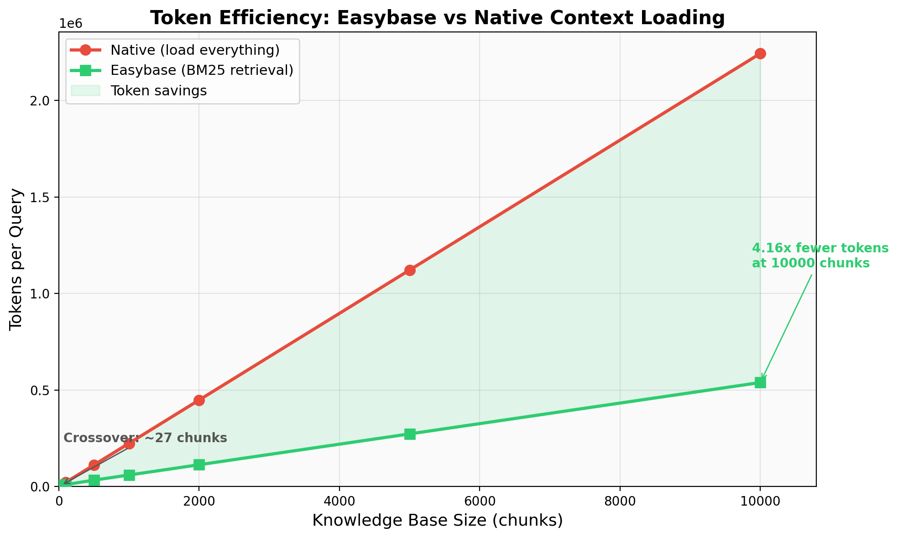
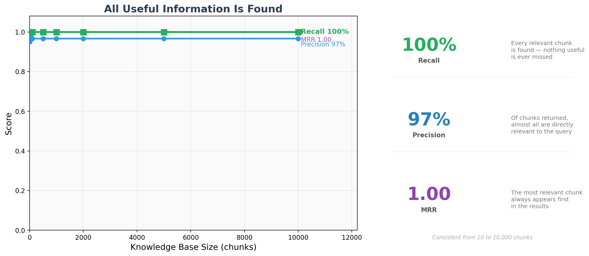
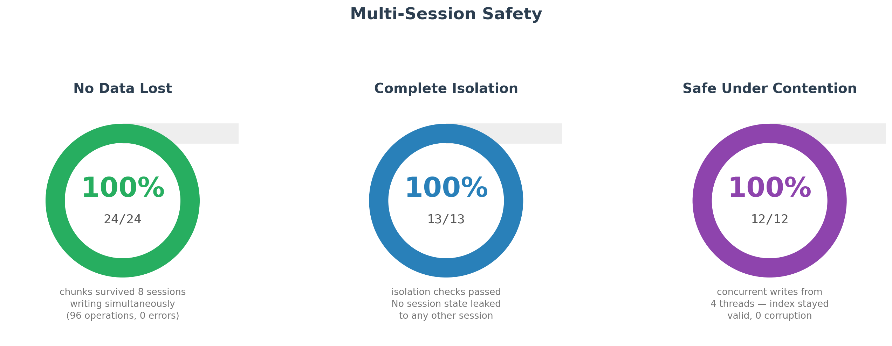

# Easybase

A BM25-based context management system that helps AI work with large knowledge bases across sessions. Store knowledge as small chunks, maintain a structural overview, and retrieve only what's relevant.

---

### What It Does

AI performs poorly with too much context, but needs accumulated knowledge to give good answers. Easybase solves both: knowledge persists as chunk files across sessions, and **every piece of useful information is extracted and delivered to the AI — everything else is abstracted away.**

The knowledge tree abstracts the entire knowledge base into a compact structural overview. When the AI needs specific detail, Easybase retrieves all the relevant chunks in full. The AI always gets complete useful information, never truncated, never diluted by irrelevant content.

### Strengths

- **All useful information, nothing else** — Relevant chunks are loaded in full. Everything outside the query's scope is abstracted in tree summaries — present as structure, not as noise.
- **User-first context** — soul.md gives the AI your background and preferences before any project knowledge.
- **Zero dependencies** — Core engine is a single Python file using only the standard library. MCP server requires one package (`mcp`).
- **Works with any MCP-compatible AI** — Claude Code, Claude Desktop, Cursor, Windsurf, and any tool that supports the Model Context Protocol.
- **Import your existing projects** — Point Easybase at your project directories during setup and it imports all of them as searchable knowledge, instantly.
- **Synonym-aware search** — Chunks get comprehensive synonym tags. A search for "authentication" finds chunks about "login" too.
- **Full inventory prevents missed info** — Every load output lists ALL chunks, so the AI can spot what BM25 didn't match.
- **Scales without slowing down** — Search time is proportional to matches, not corpus size. The inverted index never scans the full corpus.
- **AI manages everything** — The AI creates chunks, writes summaries, and maintains the knowledge base. You just use it.
- **Concurrent-safe** — Multiple AI sessions can read and write simultaneously. Per-session state tracking, atomic writes, and file locking prevent any interference.
- **Automatic capture** — Every prompt and response is recorded automatically.
- **Human-readable storage** — All chunks are plain Markdown. No database, no binary formats.
- **Audit trail** — Every operation logged with timestamps.

---

## Setup

```bash
git clone https://github.com/superyicheng/Easybase.git
cd Easybase
python3 ctx.py init
```

That's it. Init handles everything:

1. **User Profile** — set up soul.md (your preferences, background, context for the AI)
2. **Storage** — what the AI should store, enforcement mode
3. **Project Discovery** — **import all your existing projects at once.** You choose which directories Easybase is allowed to scan (e.g. `~/Projects`, `~/work`). Easybase scans those directories for projects containing AI context files (CLAUDE.md, .cursorrules, README.md, etc.) and imports every project it finds as searchable knowledge chunks. You can select which projects to import, or import all of them. You can always import more later with `python3 ctx.py scan`.
4. **MCP Server Registration** — automatically installs the `mcp` package and registers Easybase as an [MCP (Model Context Protocol)](https://modelcontextprotocol.io/) server with all detected AI tools. MCP is the standard protocol that lets AI tools call external tools — Easybase registers itself so the AI can load context, store knowledge, and search chunks through MCP tool calls. Auto-detects and auto-registers with Claude Code, Claude Desktop, Cursor, and Windsurf.

After init, start a new session in your AI tool and Easybase loads automatically. Verify it's working by asking:

1. **"Where do you store the context?"** — The AI should mention Easybase, chunks, and the knowledge base.
2. **"Did you store the last prompt and answer in Easybase?"** — The AI should confirm it stored both as chunks.

### Supported AI platforms

| Platform | Setup |
|----------|-------|
| **Claude Code** | Auto-registered during init |
| **Claude Desktop** | Auto-registered during init |
| **Cursor** | Auto-registered during init |
| **Windsurf** | Auto-registered during init |
| **Any MCP-compatible tool** | Init prints the config to copy |

Available MCP tools: `easybase_load`, `easybase_search`, `easybase_add`, `easybase_respond`, `easybase_external`, `easybase_index`, `easybase_stats`, `easybase_ingest`, `easybase_scan`, `easybase_check`, `easybase_permit`

---

## How It Works

After setup, you just talk to the AI normally. Easybase works behind the scenes — loading relevant context before the AI answers, and storing both your information and the AI's answers as searchable knowledge for future sessions.

### The loop (happens automatically)

1. **You ask something** → Easybase searches the knowledge base and gives the AI everything relevant
2. **AI answers** → Using your context (soul.md) + matching knowledge chunks + its own reasoning
3. **AI stores the answer** → The answer is saved as a new chunk so future sessions can find it
4. **AI stores your info** → Any new information you provided is also saved as a chunk

Everything accumulates. The more you use it, the more the AI knows about your projects, preferences, and past decisions.

### Where your data lives

All data is stored in `~/.easybase/` — separate from the code you cloned:

| Path | Contents |
|------|----------|
| `~/.easybase/chunks/` | Knowledge chunks (flat Markdown files, searched by BM25) |
| `~/.easybase/knowledge/` | Tree structure with summaries at each level |
| `~/.easybase/inbox/sessions/` | Auto-captured queries and responses |
| `~/.easybase/logs/changes.log` | Audit trail of all operations |
| `~/.easybase/soul.md` | Your user profile (loaded first every session) |
| `~/.easybase/permission.md` | AI access rules — per-project allowed directories and commands |
| `~/.easybase/config.yaml` | All settings |
| `~/.easybase/index.json` | Search index (regenerated automatically) |

The git clone contains only code — no personal data, no conflicts on update.
To use a different data location, set `EASYBASE_DIR` to point to your data directory.

### Update Easybase

```bash
cd Easybase
python3 ctx.py update
```

Pulls the latest code, installs any new dependencies, re-registers the MCP server, and updates the protocol — all without touching your data. Run this whenever you want the latest version.

---

## Benchmarks

Tested from 10 to 10,000 chunks (~2.2M tokens — beyond all current AI context windows).

### Token Efficiency

At 10,000 chunks of stored knowledge, Easybase uses **4.16x fewer tokens per query** than loading everything into the context window. Native context loading requires 2.2M tokens — exceeding ChatGPT (256K), Claude (200K), and Gemini (1M). Easybase uses 539K tokens, retrieving only the chunks that match.



### Retrieval Quality

**97% precision** (almost every returned chunk is relevant), **100% recall** (no relevant chunk is ever missed), and **MRR 1.0** (the best result always ranks first) — consistent from 10 to 10,000 chunks.



### Concurrent Sessions and Agent Teams

Easybase supports multiple AI sessions writing simultaneously — this is how agent teams and sub-agents work in practice. Each session gets its own state tracking (pending flags, response buffers) via per-session files, while sharing the same knowledge base. All storage is automatic after init — no configuration changes needed for multi-session use.

**What was tested:**
- **Full lifecycle** — 8 simultaneous sessions, each running 3 complete load-respond-store cycles (96 total operations). Simulates multiple sub-agents or a user talking to different agents that all write to the same knowledge base. Zero errors, zero data loss.
- **Session isolation** — Per-session flag files (pending_store, pending_external, last_response) are verified to never leak between sessions. One agent's state never interferes with another's.
- **Atomic index writes** — 4 threads adding chunks concurrently. The search index uses file locking and atomic writes (write to temp file, then rename) so concurrent writes never corrupt the index.
- **Write throughput** — 175+ chunks/second in both sequential and parallel modes, zero errors under contention.



---

## Where Easybase Won't Work

| Platform | Why |
|----------|-----|
| **Mobile apps** (ChatGPT iOS, Claude mobile) | No extensions, no CLI |
| **Desktop apps without MCP** | No tool protocol support |
| **Web AI behind corporate firewalls** | Localhost may be blocked |

---

## Project Structure

**Code** (git clone):
```
Easybase/
├── ctx.py              Core engine (Python stdlib only)
├── mcp_server.py       MCP server (requires: pip install mcp)
├── http_server.py      HTTP server for browser extension (stdlib only)
├── PROTOCOL.md         AI instructions (copied to data dir during init)
└── extension/          Browser extension (Chrome Manifest V3)
```

**Data** (`~/.easybase/`):
```
~/.easybase/
├── soul.md             User profile
├── permission.md       AI access rules
├── config.yaml         Settings
├── chunks/             Flat chunk storage for BM25
├── knowledge/          Knowledge tree with summaries
├── inbox/              Auto-captured sessions
├── logs/               Audit trail
└── index.json          BM25 search index
```

## Modified BM25

Standard BM25 (k1=1.5, b=0.75) with two modifications:

- **IDF Floor:** `IDF(t) = max(standard_idf(t), 0.1)` — common domain terms still contribute.
- **Reference Weight:** `final_score = W(d) x BM25(d, q)` where `W(d) = 1 + log(1 + refs(d))` — foundational chunks get boosted.

## Requirements

- **Core (ctx.py):** Python 3.6+. Standard library only.
- **MCP server:** Python 3.10+. Requires `mcp` package (auto-installed during init).
- **HTTP server:** Python 3.6+. Standard library only.
- **Browser extension:** Chrome, Edge, Brave, or any Chromium browser.

## License

MIT
